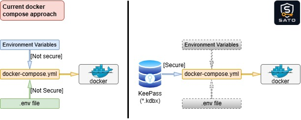

# SATO - Secure Access Task Operator

> **`sato`** — like `sudo`, but for secrets.

`sato` is a utility for running a `docker-compose.yml` file with secrets.

`sato` loads secrets from secure KeePass-compatible `.kdbx` database (DB) and runs **`docker compose`** commands using those variables.

Secrets are never exposed to the shell or written to disk in such case.


## How It Works
`Sato` searches for a `.kdbx` DB in predefined locations or paths specified by the user. Once a valid DB is found, it is used as the source of secrets.

Additionally, `sato` can safely display secret names stored in the DB (`sato get secrets`).

`sato` first reads the DB's master password and then uses the stored secrets from it to run `docker compose` commands.

`Sato` has strong security behavior: password input is not echoed to the terminal and secrets passed only to child process, never exported to shell or written to temporary files.

```bash
[unsecure] docker compose up -d => sato docker compose up -d [secure]
```

This is how in general life can be changed with `sato`:



<p><strong><span style="color:red">⚠ Pay Attention!</span></strong></p>

Utility `sato` is provided **"as is"** and its usage in a production environment is fully **at your own risk**!

[](LICENSE)
[](https://go.dev/)

---

## Installation

### 1. Prerequisites
* required:
  * OS Linux
  * [docker compose](https://docs.docker.com/compose/install/linux) - to have ability to use `sato`
* optional:
  * [git](https://git-scm.com/install/linux)           - for cloning source's repository
  * [docker](https://docs.docker.com/engine/install/)  - for manual binary building
  * [keepassxc](https://keepassxc.org/download/#linux) - to edit secrets via UI

### 2. Obtain files from Github Releases (or [build  manually](scripts/build/README.md)):

* binary file
  ```bash
  wget https://github.com/Marcus-Aprelius/sato/releases/latest/download/sato
  ```

* .deb package:
  ```bash
  wget https://github.com/Marcus-Aprelius/sato/releases/download/latest/sato_0.0.1_amd64.deb
  ```

* .rpm package:
  ```bash
  wget https://github.com/Marcus-Aprelius/sato/releases/download/latest/sato-0.0.1-1.x86_64.rpm
  ```

### 3. Install `sato`:
  ```bash
  # from binary file
  chmod +x sato && sudo mv sato /usr/local/bin/
  ```

  ```bash
  # from .deb package:
  sudo dpkg -i sato_0.0.1_amd64.deb
  ```

  ```bash
  # from .rpm package:
  sudo yum install -y sato-0.0.1-1.x86_64.rpm
  ```

---

## Flags and Commands:

* Flags:
  | Flag           | Description                         |
  |----------------|-------------------------------------|  
  | --db-path=PATH | Path to KeePass-compatible .kdbx DB |

* Commands:
  | Command                                       | Description                                                   |
  |-----------------------------------------------|---------------------------------------------------------------|
  | `sato`                                        | Show current status                                           |
  | `sato version`                                | Show version                                                  |
  | `sato help`                                   | Show help                                                     |
  | `sato completion bash`                        | Show Bash completion scripts                                  |
  | `sato get secrets`                            | List secret names from a KeePass-compatible `.kdbx` DB        |
  | `sato get secrets --tree`                     | List secret names as a group tree                             |
  | `sato get secrets --tree --show-empty-groups` | List secret names as a group tree, including empty groups     |
  | `sato docker compose <...>`                   | Run any Docker Compose command with passwords from `.kdbx` DB |
  | `sato docker compose up -d`                   | Example: start Docker containers in detached mode             |

---

## DB Locations Priority

| Priority    | Source/Location                   | Comment                                                           |
|-------------|-----------------------------------|-------------------------------------------------------------------|
| 1 (highest) | `--db-path=/path/to/secrets.kdbx` | Specify a DB location manually.                                   |
|             |                                   | if `set`     - is used, ignores locations with lower priority     | 
|             |                                   | if `not set` - finds other locations                              |
| 2           | `~/.sato/secrets.kdbx`            | Default location of the DB.                                       |
|             |                                   | if `present` - is used, ignores location with lower priority      |
|             |                                   | if `absent`  - finds other locations                              |
| 3 (lowest)  | `SATO_DB_PATH`                    | ENV variable. (i.e.: `export SATO_DB_PATH=/path/to/secrets.kdbx`) |
|             |                                   | if `set`     - is used                                            |
|             |                                   | if `not set` - finds other locations                              |

<span style="color:orange">! Pay attention !</span>

1. After specifying the DB location, `sato` will validate its presence to prevent corruption. Only valid DB locations are used; invalid locations are ignored as if they were absent.

2. If no valid DB location is set (and the DB is absent in the default location), the `sato docker compose` command will not work. Specify a valid DB location or place the DB in the default location.

3. If several valid DB locations are available - `sato` will use DB with the highest priority.

---

## Bash Completion
Enable tab completion for `sato` commands:
* for current session:
  ```bash
  source <(sato completion bash)
  ```
* permanently:
  ```bash
  sato completion bash >> ~/.bashrc && source ~/.bashrc 
  ```

---

## Playground
Demo environment for `SATO` Project. In this folder, you can try `sato` functionality before deciding whether to use it in a real environment.

See [playground/README.md](playground/README.md) for details.

### Playground lifecycle:

* create or recreate:
  ```bash
  cd playground && bash playground_create.sh
  ```

* delete the playground files
  ```bash
  cd playground && bash playground_delete.sh
  ```

---

## Testing
Tests for the project `SATO`.
See [tests/README.md](tests/README.md) for details.

### Run:
* unit tests
  ```bash
  cd tests && bash run_unit_tests.sh
  ```
* e2e tests
  ```bash
  cd tests && bash run_e2e_tests.sh
  ```
* all tests
  ```bash
  cd tests && bash run_all_tests.sh
  ```

---

## Dependencies
- Go 1.26+
- gokeepasslib/v3 (KeePass reader)
- golang.org/x/term (terminal handling)


## License

© 2026 [Marcus-Aprelius](https://github.com/Marcus-Aprelius/sato)

[Apache License 2.0](LICENSE)
